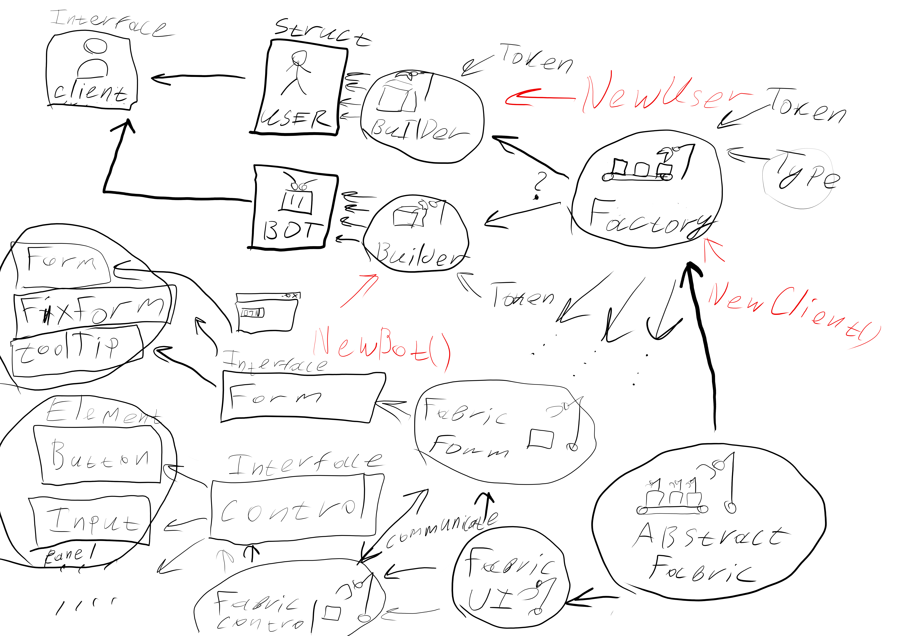
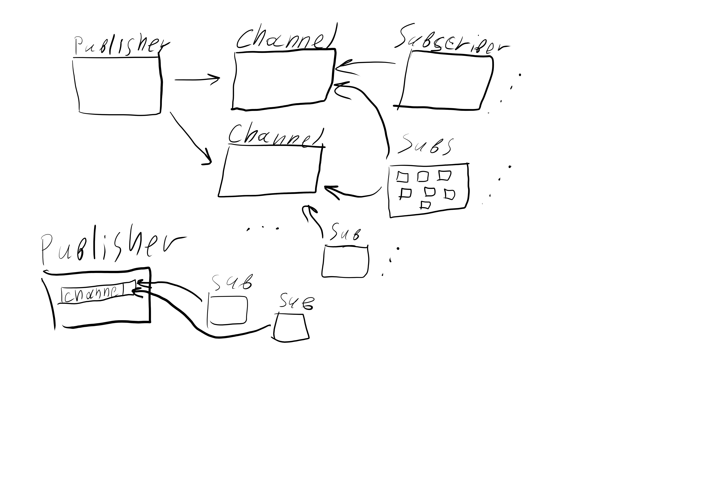

# Factory and Abstract Factory

Фабрика не создаёт объекта, а делегирует
их создание билдерам, которые создают 
объекты с одинаковым интерфейсом.

Абстрактная фабрика - фабрика для фабрик.
В конечном счёте созаёт объекты которые могут
как-то взаимодействовать с другими
объектами созданными этой абстрактной
фабрикой. (Используется редко)

# Event Channel

Есть публикатор, который можешь писать
сообщения в различные каналы.

Есть каналы, на которые могут подписываться
пользователи и сообщение
отправленное в канал будет доставлено
всем его пользователям.

Есть пользователи которые реализуют интерфейс
подписчика и получают уведомление
когда приходит сообщение в канал на который
они подписаны.

Один пользователь может быть подписан на
несколько каналов, а один публикатор может
писать в несколько каналов.